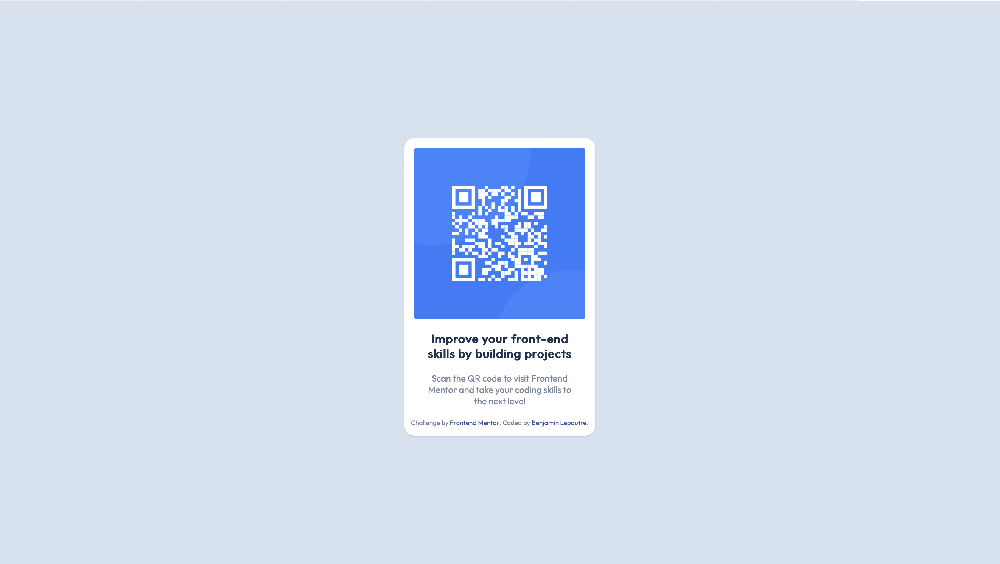

# Frontend Mentor Challenges - QR code component solution

This is my solution to the [QR code component challenge on Frontend Mentor](https://www.frontendmentor.io/challenges/qr-code-component-iux_sIO_H). Frontend Mentor challenges help me improve my coding skills by building realistic projects.

## Table of contents

- [Overview](#overview)
  - [Screenshot](#screenshot)
  - [Links](#links)
- [My process](#my-process)
  - [Built with](#built-with)
  - [What I learned](#what-i-learned)
  - [Continued development](#continued-development)
- [Author](#author)
- [Sources of inspiration](#sources-of-inspiration)

## Overview

### Screenshot

### Links
My solution : [(https://your-solution-url.com)]

## My process

### Built with

- Semantic HTML5 markup
- CSS custom properties
- Flexbox
- Mobile-first workflow
- JavaScript
  For styles

### What I learned

I've started learning how to create a repository on GitHub, which is no mean feat for a beginner. I'm still trying to figure out how to manage the confidentiality of different directories to control the accessibility of my folders.

### Continued development

I feel quite comfortable learning css and html and their subtleties but I feel more uncomfortable with javascript and I think I should concentrate more on this language to improve my performance.

## Author

- Website - [blepoutre](https://www.your-site.com)
- Frontend Mentor - [@blepoutre](https://www.frontendmentor.io/profile/blepoutre)

## Sources of inspiration

- [PlayCss.app](https://playcss.app)
- [CSSbattle.dev](https://cssbattle.dev)

